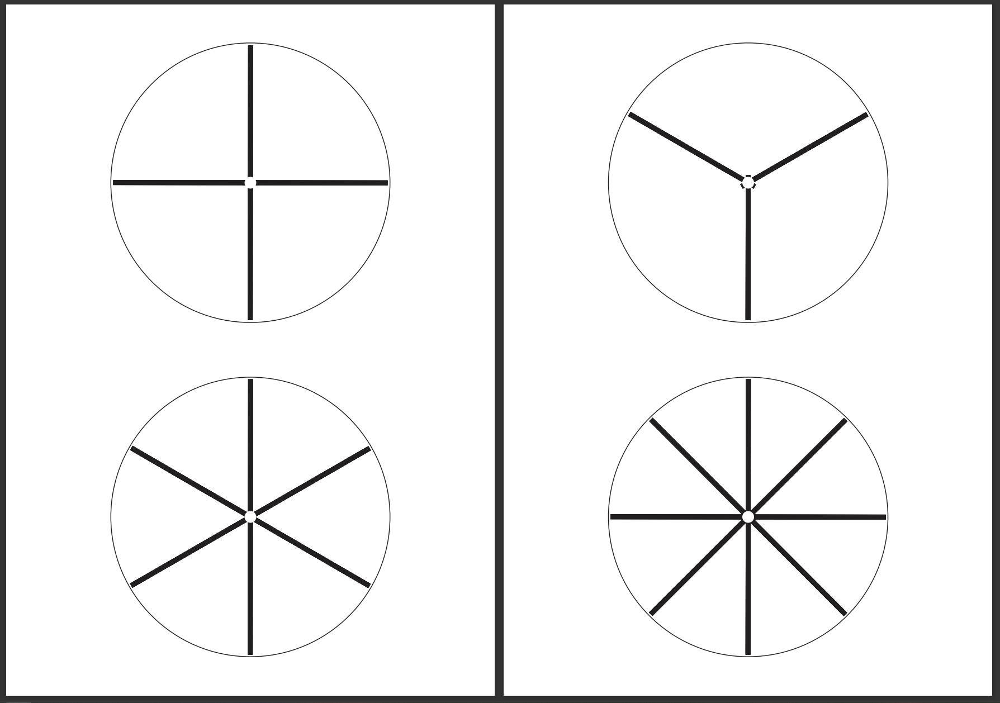
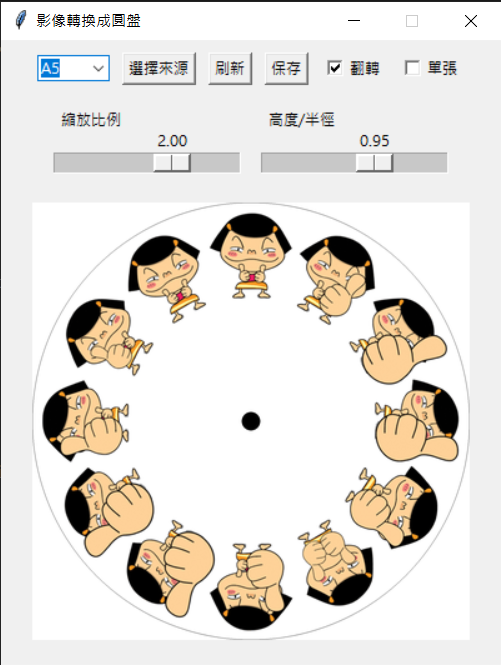

# Phantom-Roulette

頻閃效應是一種視覺現象，當物體以特定速度旋轉並配合閃爍的光源時，觀察者會看到物體呈現近乎靜止或緩慢運動的效果。

## 教具軟體內容與檔案
### sample_pattern
提供了一些基本的範例圖案，可供使用與參考。   
   

列印時請選擇不要縮放或者實際大小列印。   

### Disk Generator
可上傳影像，並產生直徑為12cm之圓盤，具有兩種模式：

- **單張圖片模式**   
  可接受一張圖片，並透過改變 `縮放比例` 與`高度/半徑`調整圖片大小與位置，勾選 `翻轉` 上下鏡射圖片。
  

- **連續圖片模式**   
  可接受 `.gif` 檔案，並透過改變 `縮放比例` 與`高度/半徑`調整連續圖片的大小與半徑，勾選 `翻轉` 鏡射動畫內外方向。   
  

選擇紙張尺寸，並點擊 `保存` 即可儲存圓盤檔案，列印時請選擇不要縮放或者實際大小列印。

## Todos
  ### UI
- [x] change from PWM to percent (e.g. 0.001%)
- [x] customization the frequency multiplier
- [ ] find a way to control the frequency easier and precise
- [ ] mobile friendly interface (w/o keyboard so no up and down key)

  ### Hardware
- [ ] need to **hook up** to one board
- [ ] buy frequency generator
- [ ] buy voltage regulator
- [ ] buy MOS-FET (DIY stroboscope)
- [ ] disc **replacement** (important) ***may change the material to acrylic
- [ ] may use a relay to control ***reverse function***

  ### Software
- [ ] let it be more stability as possible
- [ ] measure the output using Oscilloscope (ensure the output is precise enough)
- [ ] find out more method or mode to demo
- [ ] ??? add fast demo mode (preset for specific scenario)
- [ ] implement the python into website (disc maker)