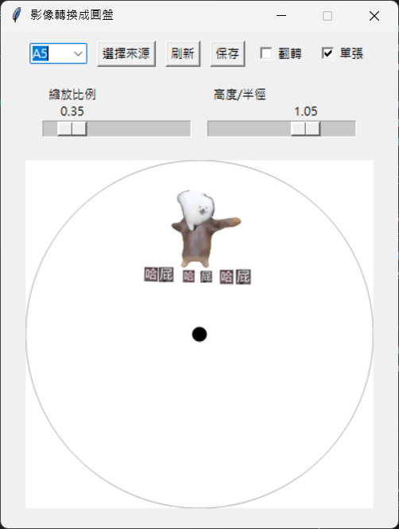

# Phantom-Roulette

頻閃效應是一種視覺現象，當物體以特定速度旋轉並配合閃爍的光源時，觀察者會看到物體呈現近乎靜止或緩慢運動的效果。

## 教具軟體內容
### Disk Generator
可上傳影像，並產生直徑為12cm之圓盤，具有兩種模式：

- **單張圖片模式**   
  可接受一張圖片，並透過改變 `縮放比例` 與`高度/半徑`調整圖片大小與位置，勾選 `翻轉` 上下鏡射圖片。
  

- **連續圖片模式**   
  可接受 `.gif` 檔案，並透過改變 `縮放比例` 與`高度/半徑`調整連續圖片的大小與半徑，勾選 `翻轉` 鏡射動畫內外方向。
